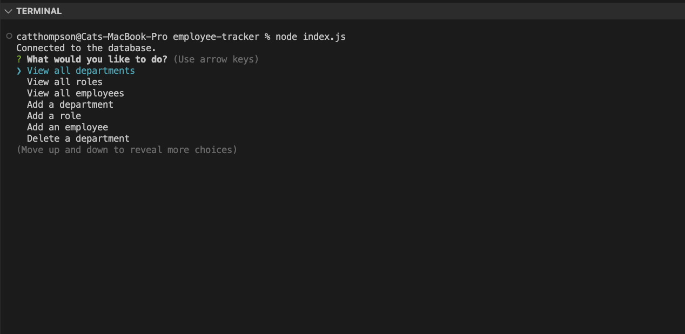
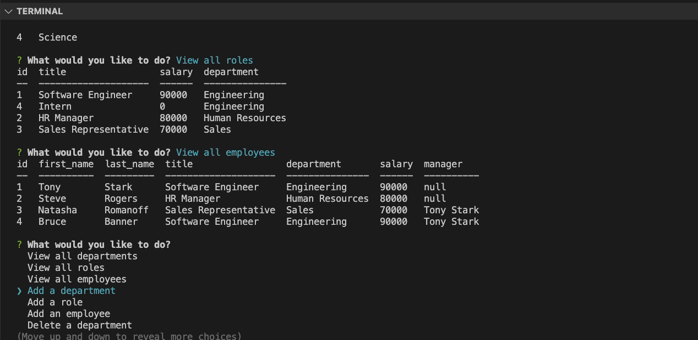
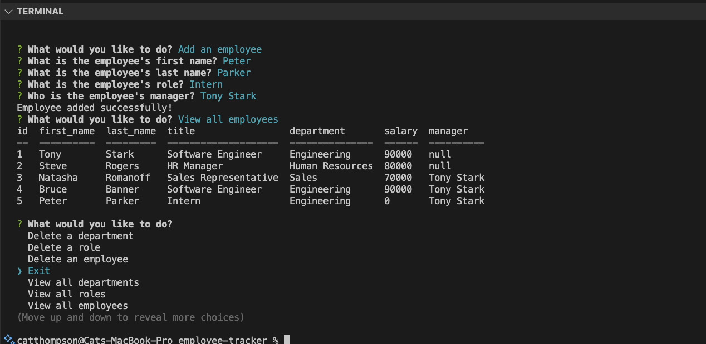

# employee-tracker

# 12 SQL: Employee Tracker

## 📝 Description

Employee Tracker is a command-line application built with Node.js, MySQL, and Inquirer. It allows users to manage a company's employee database by performing various operations such as viewing departments, roles, and employees, adding new departments, roles, and employees, updating employee roles, and more.

## 🚀 Getting Started

1. Clone this repository to your local machine using `git clone`.
2. Navigate to the project directory.
3. Install the required dependencies by running `npm install`.
4. Set up your MySQL database by running the schema SQL commands provided in `schema.sql`.
5. (Optional) If you have initial data to insert, run the SQL commands from `seeds.sql`.
6. Update the database connection details in `connection.js` if necessary.

## 📋 User Story

AS A business owner
I WANT to be able to view and manage the departments, roles, and employees in my company
SO THAT I can organize and plan my business

## 📋 Acceptance Criteria

- GIVEN a command-line application that accepts user input
- WHEN I start the application
- THEN I am presented with the following options: view all departments, view all roles, view all employees, add a department, add a role, add an employee, and update an employee role
- WHEN I choose to view all departments
- THEN I am presented with a formatted table showing department names and department ids
- WHEN I choose to view all roles
- THEN I am presented with the job title, role id, the department that role belongs to, and the salary for that role
- WHEN I choose to view all employees
- THEN I am presented with a formatted table showing employee data, including employee ids, first names, last names, job titles, departments, salaries, and managers that the employees report to
- WHEN I choose to add a department
- THEN I am prompted to enter the name of the department and that department is added to the database
- WHEN I choose to add a role
- THEN I am prompted to enter the name, salary, and department for the role and that role is added to the database
- WHEN I choose to add an employee
- THEN I am prompted to enter the employee’s first name, last name, role, and manager, and that employee is added to the database
- WHEN I choose to update an employee role
- THEN I am prompted to select an employee to update and their new role and this information is updated in the database

## 🎥 Walkthrough Video

A walkthrough video demonstrating the functionality of the application can be found [here](https://vimeo.com/919393285?share=copy).

## ✨ Features

- View all departments, roles, and employees
- Add new departments, roles, and employees
- Update employee roles
- Update employee managers
- View employees by manager
- View employees by department
- Delete departments, roles, and employees
- View the total utilized budget of a department

## 📷 Screenshots

## 💡 Resources

- MDN Web Docs
- W3Schools
- Node.js
- MySQL
- Inquirer
- XPert Learning Assistant

## 📝 License

This project is licensed under the MIT License.
